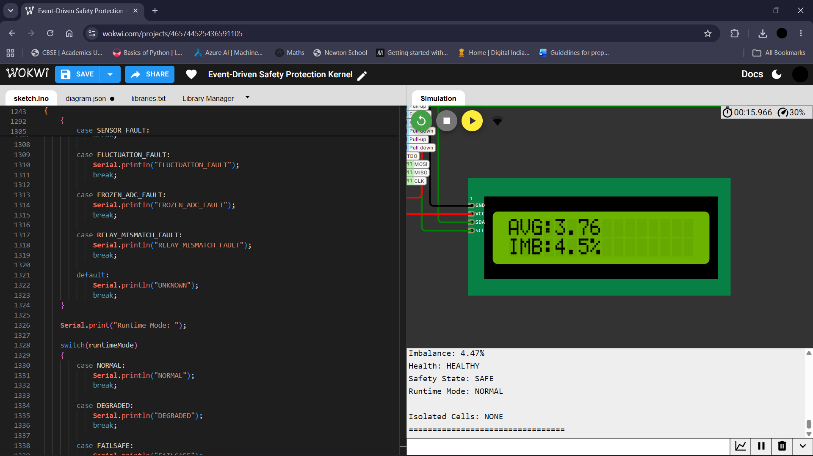
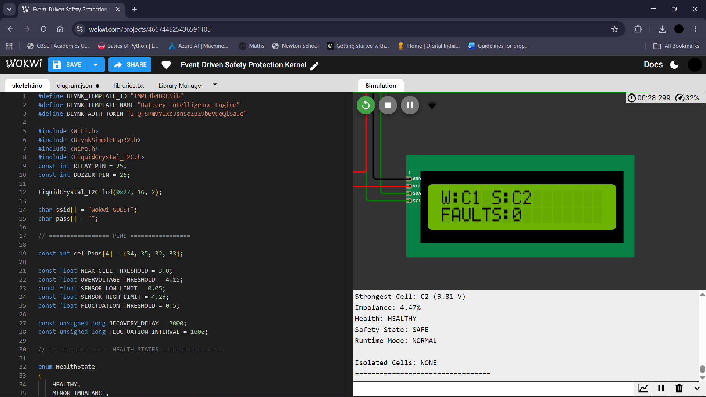
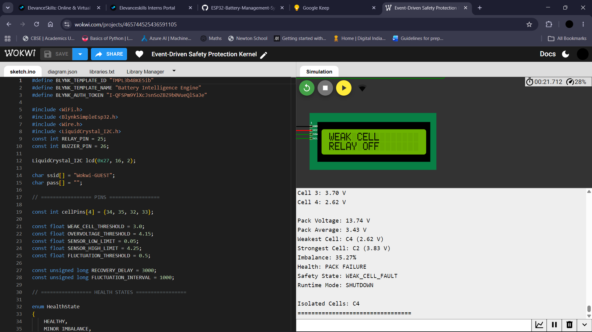
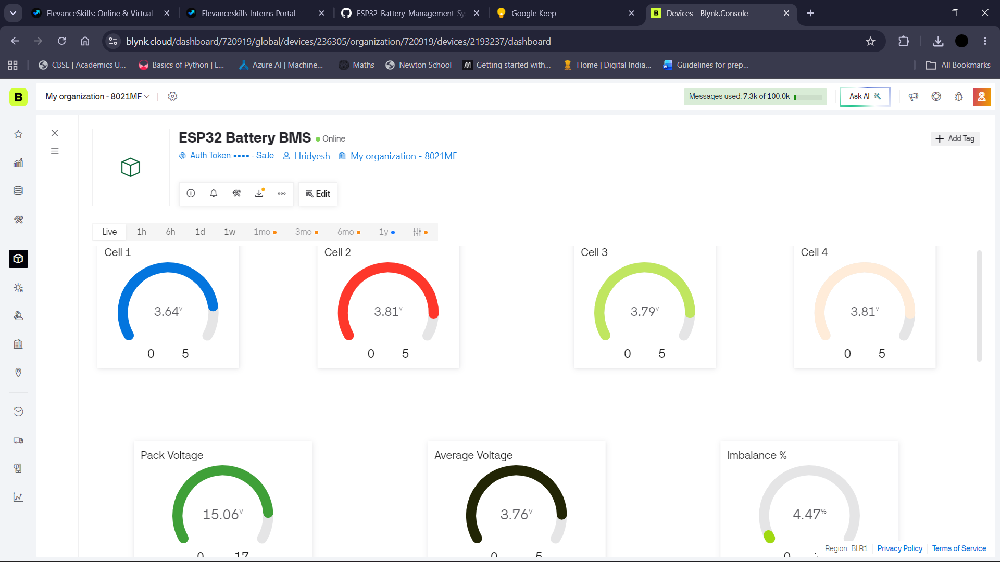
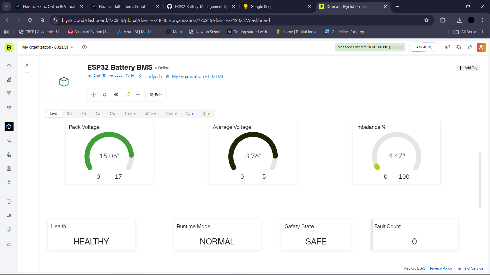
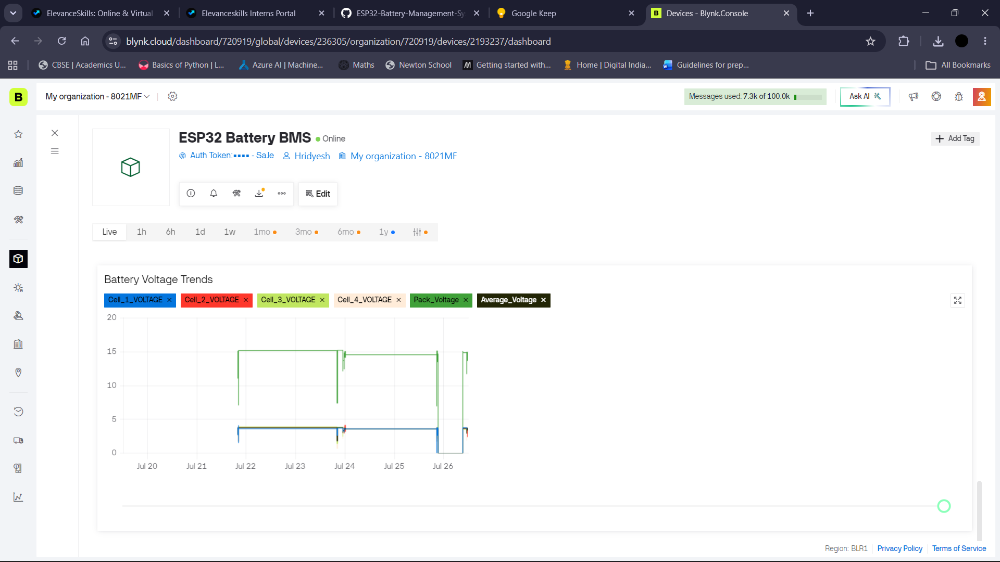
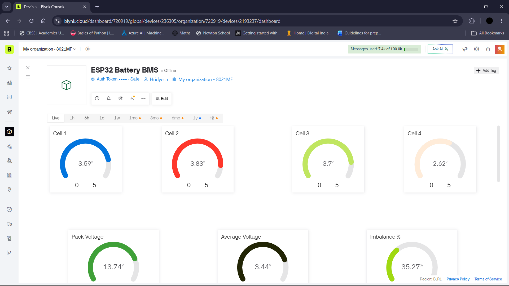
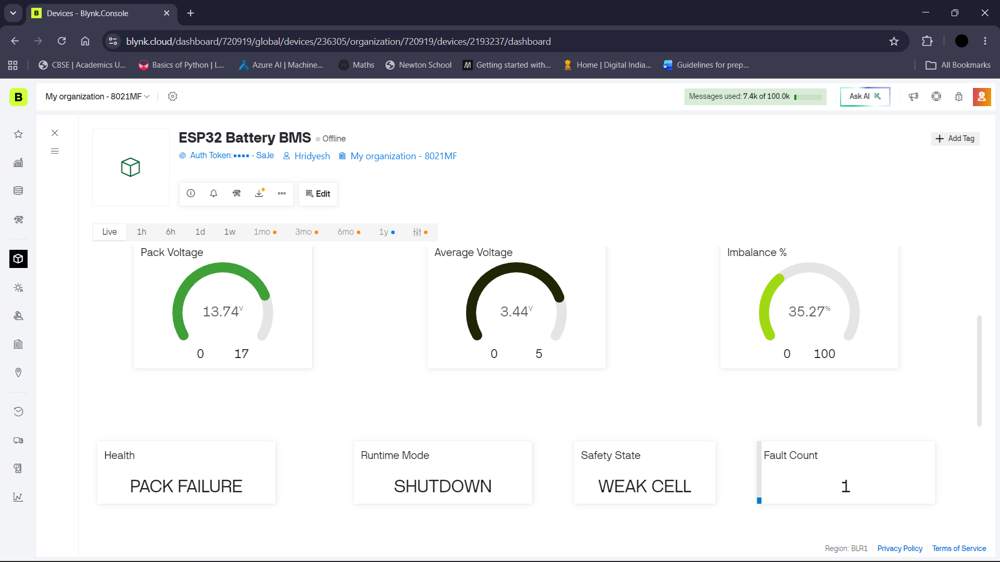
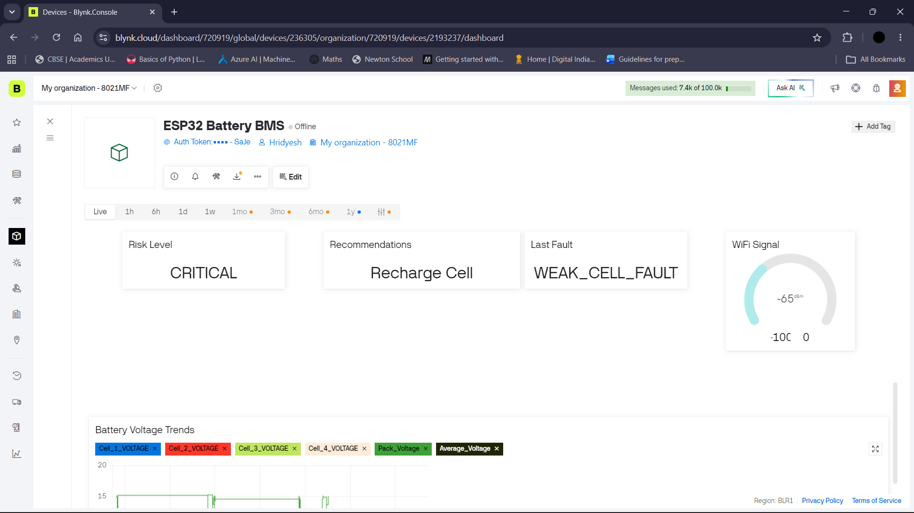
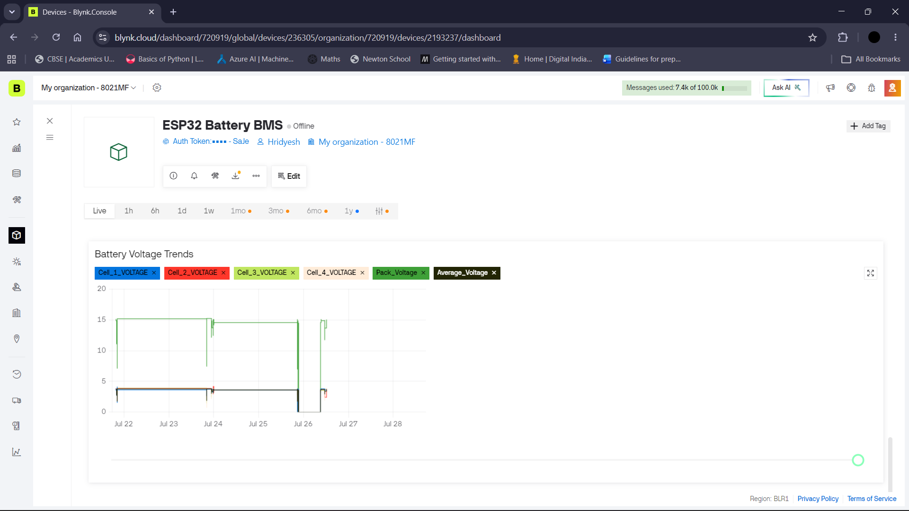

# ESP32-Battery-Management-System
Real-Time ESP32 Battery Management System featuring intelligent fault detection, safety protection, LCD diagnostics, relay control, and Blynk IoT monitoring using Wokwi simulation.

# 🔋 ESP32 Battery Management System

### Real-Time Intelligent IoT Battery Monitoring & Safety Protection System

<p>
An enterprise-grade embedded Battery Management System (BMS) developed using ESP32, designed to monitor a simulated 4-cell lithium battery pack in real time. The system combines intelligent battery analytics, event-driven safety protection, fault-tolerant runtime management, cloud telemetry, and a professional IoT dashboard into a single integrated embedded solution.
</p>


</div>

---

# 📖 Project Overview

This project was developed as part of the **Elevance Skills Embedded Systems Internship Program**. The objective was to design and implement a **production-inspired Battery Management System (BMS)** capable of monitoring a simulated **4-cell lithium battery pack** while demonstrating professional embedded software engineering practices.

Unlike a conventional Arduino demonstration project, this implementation integrates multiple embedded subsystems into a single modular application, including:

- Real-time battery intelligence and analytics
- Event-driven safety protection
- Intelligent Human-Machine Interface (HMI)
- Fault-tolerant runtime management
- Cloud-based IoT telemetry
- Executive battery monitoring dashboard

The system continuously monitors individual battery cells, evaluates battery health, detects abnormal operating conditions, transitions between runtime modes, and communicates operational data to the cloud through **Blynk IoT**. The entire software architecture is built around a **non-blocking event-driven design**, ensuring responsive operation without using `delay()`.

---

# 🎯 Project Objectives

The project was designed to accomplish the following objectives:

- Monitor four simulated lithium battery cells in real time.
- Calculate pack voltage, average voltage, imbalance percentage, and battery statistics.
- Classify battery health into operational states.
- Detect and isolate battery faults using intelligent safety logic.
- Protect the battery pack through automatic relay control and audible alarms.
- Display live diagnostics using a rotating LCD-based HMI.
- Transmit operational telemetry to the Blynk IoT cloud platform.
- Maintain stable operation during Wi-Fi failures and automatically synchronize after reconnection.
- Provide operators with real-time recommendations, risk analysis, and fault history through an executive monitoring dashboard.

---

# ✅ Internship Tasks Completed

This project successfully integrates **all six internship tasks** into a single modular embedded application. Instead of developing six independent programs, every task has been implemented as part of one production-style Battery Management System.

| Task | Description | Status |
|------|-------------|:------:|
| **Task 1** | Adaptive Multi-Cell Battery Intelligence Engine | ✅ Completed |
| **Task 2** | Event-Driven Safety Protection Kernel | ✅ Completed |
| **Task 3** | Intelligent Embedded HMI & Diagnostic Interface | ✅ Completed |
| **Task 4** | Fault-Tolerant Embedded Runtime System | ✅ Completed |
| **Task 5** | Intelligent Cloud Telemetry Architecture | ✅ Completed |
| **Task 6** | Executive Battery Intelligence Dashboard | ✅ Completed |

---

# ⭐ Key Features

### 🔋 Adaptive Battery Intelligence
- Real-time monitoring of 4 simulated lithium battery cells
- Individual cell voltage measurement
- Pack voltage calculation
- Average cell voltage calculation
- Weakest and strongest cell identification
- Cell imbalance percentage analysis
- Intelligent battery health evaluation

---

### 🛡 Event-Driven Safety Protection
- Fully non-blocking architecture using `millis()`
- Zero use of `delay()`
- Automatic relay protection
- Buzzer warning system
- Fault-priority handling
- Stable state transitions
- Anti-relay chatter protection
- Automatic recovery logic

---

### ⚙ Fault-Tolerant Runtime System

Supports intelligent runtime transitions between:

- 🟢 NORMAL
- 🟡 DEGRADED
- 🟠 FAILSAFE
- 🔴 SHUTDOWN

Implemented fault detection:

- Weak Cell Fault
- Overvoltage Fault
- Sensor Fault
- Frozen ADC Detection
- Voltage Fluctuation Detection
- Relay Mismatch Detection

Additional runtime capabilities:

- Fault isolation
- Timestamped fault logging
- Fault history
- Recovery management
- Runtime diagnostics

---

### 📺 Intelligent LCD Human-Machine Interface

- Five rotating diagnostic screens
- Smooth flicker-free display updates
- Live battery statistics
- Runtime information
- Safety status
- Automatic fault-priority screen override

---

### ☁ Intelligent Cloud Telemetry

- Blynk IoT cloud integration
- State-change-based telemetry transmission
- Wi-Fi auto reconnect
- Event queue synchronization
- Offline-safe embedded operation
- Asynchronous cloud communication

---

### 📊 Executive Monitoring Dashboard

Professional IoT dashboard displaying:

- Individual cell voltages
- Pack voltage
- Average voltage
- Weakest & strongest cell
- Battery health
- Runtime mode
- Safety status
- Fault counter
- Last detected fault
- Risk level
- Operator recommendation
- System uptime

---

# 📊 Project Statistics

| Parameter | Value |
|-----------|------:|
| **Platform** | ESP32 |
| **Programming Language** | Arduino C++ |
| **Simulation Platform** | Wokwi |
| **IoT Platform** | Blynk |
| **Embedded Architecture** | Event-Driven |
| **Battery Cells** | 4 |
| **Internship Tasks Completed** | 6 / 6 |
| **Runtime Modes** | 4 |
| **Fault Types Implemented** | 6 |
| **LCD Diagnostic Screens** | 5 |
| **Cloud Dashboard** | Executive Blynk Dashboard |
| **Code Size** | ~1372 Lines |
| **Project Status** | Completed |

---

# 🛠 Hardware Components

| Component | Quantity |
|-----------|:--------:|
| ESP32 Development Board | 1 |
| 16x2 I2C LCD Display | 1 |
| Potentiometers (Simulated Battery Cells) | 4 |
| Relay Module | 1 |
| Active Buzzer | 1 |

---

# 💻 Software & Technologies

| Technology | Purpose |
|------------|---------|
| Arduino IDE | Embedded firmware development |
| ESP32 Framework | Microcontroller platform |
| Wokwi | Circuit simulation |
| Blynk IoT | Cloud dashboard & telemetry |
| GitHub | Version control & documentation |

---

# 📂 Repository Structure

```text
ESP32-Battery-Management-System/
│
├── Code/
│   └── Battery_Management_System.ino
│
├── Diagrams/
│   ├── Architecture_Diagram.png
│   └── Workflow_Diagram.png
│
├── Images/
│   ├── Dashboard_Healthy_1.png
│   ├── Dashboard_Healthy_2.png
│   ├── Dashboard_Healthy_3.png
│   ├── Dashboard_Healthy_4.png
│   ├── Dashboard_Fault_1.png
│   ├── Dashboard_Fault_2.png
│   ├── Dashboard_Fault_3.png
│   ├── Dashboard_Fault_4.png
│   ├── LCD_Healthy_1.png
│   ├── LCD_Healthy_2.png
│   ├── LCD_Healthy_3.png
│   ├── LCD_Healthy_4.png
│   ├── LCD_Healthy_5.png
│   ├── LCD_Fault.png
│   ├── Fault_Count.png
│   ├── Dashboard_Fault_Count.png
│
├── Wokwi/
│   ├── diagram.json
│   └── libraries.txt
│
├── README.md
├── LICENSE
└── .gitignore
```

---

# 🏗 System Architecture

The ESP32 Battery Management System follows a modular event-driven embedded architecture where each subsystem operates independently while sharing battery information through a centralized processing pipeline.

The system continuously acquires battery data, performs intelligent analytics, evaluates system safety, updates the Human-Machine Interface, and synchronizes important events with the Blynk cloud platform.

<p align="center">

</p>

---

# 🔄 System Workflow

The software executes continuously without using blocking delays.

Each iteration of the main loop performs only the required operations, allowing every subsystem to run cooperatively using `millis()`-based scheduling.

<p align="center">

</p>

---

# 🔋 Adaptive Multi-Cell Battery Intelligence Engine

The Battery Intelligence Engine forms the analytical core of the system. It continuously acquires analog measurements from four simulated lithium battery cells and converts the readings into meaningful operational information.

Instead of only displaying voltages, the engine performs multiple analytical calculations to determine the overall condition of the battery pack.

### Battery Parameters Calculated

| Parameter | Description |
|-----------|-------------|
| Cell Voltage | Individual voltage of each battery cell |
| Pack Voltage | Total voltage of all four cells |
| Average Voltage | Average voltage across the battery pack |
| Weakest Cell | Lowest voltage cell |
| Strongest Cell | Highest voltage cell |
| Cell Imbalance | Difference between weakest and strongest cell |
| Battery Health | Overall health classification |

---

## 🔍 Real-Time Cell Monitoring

The ESP32 continuously reads all four analog channels connected to simulated battery cells.

Each reading is converted into a battery voltage before further processing.

The monitoring engine provides:

- Continuous voltage acquisition
- Live battery statistics
- Pack analysis
- Cell comparison
- Intelligent battery diagnostics

---

## 📈 Battery Analytics

The analytical subsystem automatically determines:

- Pack Voltage
- Average Cell Voltage
- Weakest Cell
- Strongest Cell
- Voltage Difference
- Cell Imbalance Percentage

These calculations are updated continuously throughout system operation, allowing every subsystem to operate using the latest battery information.

---

## ❤️ Battery Health Classification

The Battery Management System automatically evaluates battery condition using calculated imbalance percentages and voltage thresholds.

### Supported Health States

| Health State | Description |
|--------------|-------------|
| 🟢 Healthy | Battery pack operating normally |
| 🟡 Minor Imbalance | Small voltage difference detected |
| 🟠 Critical Imbalance | Significant imbalance requiring attention |
| 🔴 Pack Failure | Battery pack no longer safe for operation |

The health state is displayed on:

- LCD HMI
- Blynk Dashboard
- Serial Monitor
- Diagnostic Reports

allowing operators to quickly understand overall battery condition.

---

# 🛡 Event-Driven Safety Protection Kernel

The Safety Protection Kernel is responsible for continuously monitoring battery conditions and protecting the system whenever abnormal behavior is detected.

Unlike traditional Arduino implementations that rely on blocking delays, this project uses a **fully non-blocking event-driven architecture** based entirely on `millis()`. This allows battery monitoring, safety protection, LCD updates, telemetry transmission, and cloud communication to execute concurrently without affecting system responsiveness.

---

## ⚡ Protection Strategy

The kernel continuously evaluates battery data against predefined safety thresholds.

Whenever an unsafe condition is detected, the corresponding protection routine is executed automatically.

Protection actions include:

- Immediate relay isolation
- Audible buzzer warning
- LCD fault notification
- Runtime mode transition
- Fault logging
- Cloud event synchronization
- Automatic recovery monitoring

---

# 🚨 Fault Detection System

The Battery Management System implements multiple fault detection mechanisms to improve operational reliability and system safety.

| Fault Type | Detection Purpose | Protective Action |
|------------|-------------------|-------------------|
| Weak Cell Fault | Cell voltage below safe operating threshold | Relay OFF, Warning, Recovery Monitoring |
| Overvoltage Fault | Cell voltage exceeds safe limit | Relay OFF, Warning, Recovery Monitoring |
| Sensor Fault | Invalid sensor readings or disconnected input | Fault Isolation, Runtime Protection |
| Frozen ADC Detection | ADC readings remain unchanged for abnormal duration | Sensor Isolation & Fault Logging |
| Voltage Fluctuation Detection | Rapid voltage variation indicating instability | Temporary Safety Protection |
| Relay Mismatch Detection | Relay feedback differs from commanded state | Relay Fault Notification |

---

## 📝 Fault Logging System

Every detected fault is automatically recorded with its corresponding timestamp.

The logging subsystem maintains structured diagnostic information for future analysis and dashboard visualization.

Each logged event stores:

- Fault Name
- Detection Timestamp
- Recovery Status

This information is used for:

- Fault History
- Dashboard Diagnostics
- Runtime Monitoring
- Event Queue Synchronization

---

# ⚙ Fault-Tolerant Runtime System

Instead of shutting down immediately after every abnormal condition, the Battery Management System transitions intelligently between multiple operational modes.

This enables the embedded software to continue operating safely whenever possible.

---

## Runtime Modes

| Runtime Mode | Description |
|--------------|-------------|
| 🟢 NORMAL | All operating conditions are healthy |
| 🟡 DEGRADED | Minor faults detected while maintaining operation |
| 🟠 FAILSAFE | Critical protection active with restricted functionality |
| 🔴 SHUTDOWN | Severe fault requiring complete system isolation |

The runtime controller continuously evaluates system conditions and automatically transitions between these modes based on battery status and fault severity.

---

# 🔄 Automatic Recovery Logic

The system continuously checks whether detected faults have been cleared.

If operating conditions return to safe limits:

- Fault status is updated
- Runtime mode is restored
- Relay operation resumes
- LCD returns to normal diagnostics
- Dashboard updates automatically

This recovery process prevents unnecessary permanent shutdowns while ensuring battery safety.

---

# 🔒 Relay Protection

The relay acts as the primary electrical protection device.

During unsafe operating conditions, the Battery Management System disconnects the simulated battery pack by automatically disabling the relay.

Relay protection prevents continued operation during:

- Weak Cell Fault
- Overvoltage Fault
- Critical Runtime Conditions

Anti-relay chatter logic is implemented to prevent rapid switching caused by unstable sensor readings.

---

# 🔔 Audible Warning System

The active buzzer provides immediate operator feedback whenever a critical event occurs.

Warning notifications are generated during:

- Critical battery faults
- Protection activation
- Runtime transitions

This allows operators to recognize abnormal conditions without continuously monitoring the dashboard.

---

# 🧠 Fault Isolation Strategy

A key objective of the runtime architecture is to isolate faults without unnecessarily interrupting healthy subsystems.

Rather than stopping the entire application, individual fault conditions are managed independently while allowing unaffected modules to continue operating.

This modular approach improves:

- Reliability
- Fault tolerance
- System stability
- Maintainability
- Scalability

---

# 📺 Intelligent Embedded HMI & Diagnostic Interface

The system features a **16×2 I2C LCD** that provides real-time battery diagnostics through an intelligent rotating display interface. The LCD serves as the primary local Human-Machine Interface (HMI), allowing operators to monitor system performance without requiring cloud connectivity.

Unlike a static display, the interface cycles automatically through multiple diagnostic screens while maintaining smooth, flicker-free updates using a non-blocking event-driven architecture.

---

## Displayed Information

The LCD continuously presents:

- Individual Cell Voltages (C1–C4)
- Pack Voltage
- Average Cell Voltage
- Battery Health Status
- Cell Imbalance Percentage
- Runtime Mode
- Safety Status
- Active Fault Messages

During normal operation, diagnostic screens rotate automatically. Whenever a critical fault is detected, the rotating display is temporarily overridden to immediately present the corresponding fault message, ensuring the operator is instantly informed of unsafe conditions.

---

## LCD Features

- Real-time battery diagnostics
- Five rotating information screens
- Automatic fault-priority display
- Flicker-free updates
- Event-driven screen switching
- Continuous monitoring without interrupting system execution

<p align="center">


</p>

<p align="center">


</p>

<p align="center">


</p>

---

# ☁ Intelligent Cloud Telemetry Architecture

The Battery Management System integrates with **Blynk IoT** to provide remote monitoring and real-time visualization of battery conditions. Operational data is continuously synchronized with the cloud, allowing users to observe battery performance from any connected device.

To reduce unnecessary network traffic, telemetry is transmitted using a **state-change-based communication strategy**. Data is sent only when meaningful changes occur or after predefined update intervals, minimizing bandwidth usage while preserving real-time responsiveness.

---

## Cloud Features

- Secure Wi-Fi connectivity
- Automatic Wi-Fi reconnection
- State-change-based telemetry
- Event queue synchronization
- Cloud status monitoring
- Offline-safe operation
- Automatic dashboard synchronization after reconnect

---

## Dashboard Parameters

The Executive Dashboard displays:

- Cell Voltages
- Pack Voltage
- Average Voltage
- Weakest Cell
- Strongest Cell
- Battery Health
- Runtime Mode
- Safety State
- Fault Counter
- Last Fault
- Risk Level
- Recommendation
- System Uptime

---

# 📊 Executive Battery Intelligence Dashboard

The project includes a professional **Blynk Executive Dashboard** designed to provide operators with a centralized view of the entire battery system.

The dashboard combines battery analytics, runtime diagnostics, fault information, and operator recommendations into a single interface for quick decision-making.

---

## Dashboard Highlights

- Live battery monitoring
- Runtime diagnostics
- Fault history
- Risk assessment
- Operator recommendations
- Cloud-based monitoring
- Real-time visualization

<p align="center">

</p>

<p align="center">

</p>

<p align="center">

</p>

<p align="center">

</p>

<p align="center">

</p>

<p align="center">

</p>

<p align="center">

</p>

<p align="center">

</p>

---

# 🚀 Getting Started

## Prerequisites

- Arduino IDE
- ESP32 Board Package
- Blynk IoT Account
- Wokwi Simulator (optional)

---

## Required Libraries

- WiFi
- Blynk
- LiquidCrystal_I2C

---

## Running the Project

1. Clone this repository.
2. Open `Code/Battery_Management_System.ino` using Arduino IDE.
3. Install the required libraries.
4. Configure your Wi-Fi credentials and Blynk authentication token.
5. Upload the sketch to an ESP32 or run the project in Wokwi.
6. Open the Blynk Dashboard to monitor the system in real time.

---

# 🔮 Future Improvements

Potential enhancements for future versions include:

- Battery State of Charge (SoC) estimation
- Battery State of Health (SoH) prediction
- Temperature monitoring using dedicated sensors
- CAN Bus communication
- SD card data logging
- OTA firmware updates
- Real lithium battery pack integration
- Machine learning-based battery analytics
- Predictive maintenance algorithms

---

# 👨‍💻 Author

**Hridyesh Singh Bisht**

B.Tech Automation & Robotics Engineering  
Symbiosis University of Applied Sciences, Indore

Developed as part of the **Elevance Skills Embedded Systems Internship Program**.

---

# 🙏 Acknowledgements

Special thanks to:

- Elevance Skills Internship Program
- Wokwi Simulation Platform
- Blynk IoT
- Arduino Community
- Espressif Systems

---

# 📜 License

This project is licensed under the **MIT License**.

See the `LICENSE` file for additional information.
